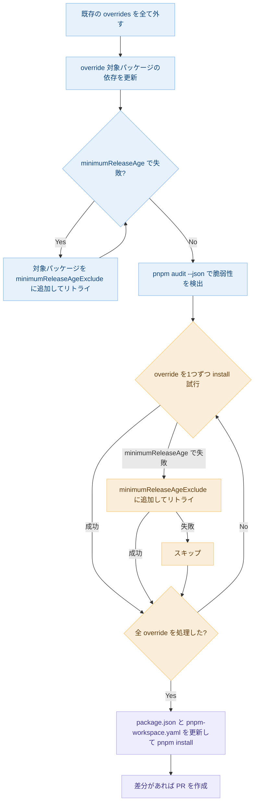
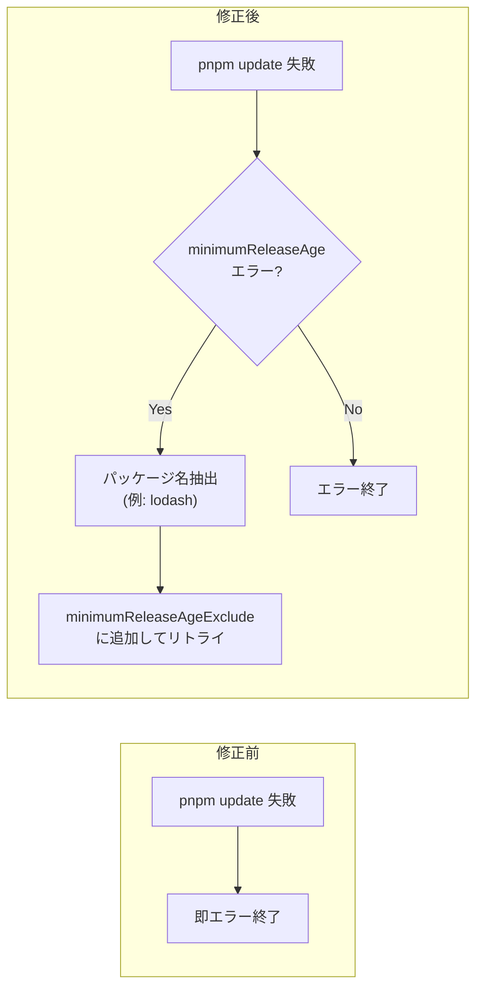

# resolve-audit.ts フロー

## 全体フロー

## 今回の修正箇所

記事のフローでは `override 対象パッケージの依存を更新`（`pnpm update`）のステップにエラーハンドリングがなかった。
`pnpm update` は指定パッケージだけでなく lockfile 全体を再解決するため、
override 対象外の transitive 依存（例: `recharts` -> `lodash`）が `minimumReleaseAge` に引っかかるとエラーになる。

Phase 4（個別試行）には既にリトライロジックがあったが、Phase 1（依存更新）にはなかったため追加した。

